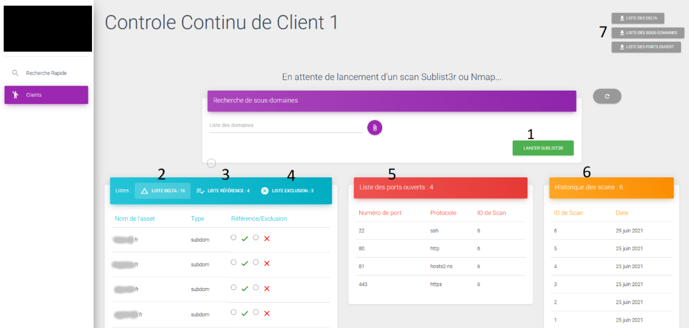

# ControleContinu

## Description du project
Cette projet a pour objectif d’analyser l’exposition web des clients mensuellement afin d’en observer l’évolution au cours du temps. En effet, un test d’intrusion externe est une image en un instant Δt du niveau de vulnérabilité d’un périmètre. Grâce aux analyses d’expositions mensuelles, un client est en mesure de savoir régulièrement si son périmètre est vulnérable ou non.
Utilisation de 3 outils principaux :
• Sublist3r
• Dig
• Nmap

## Workflow

## Interface

